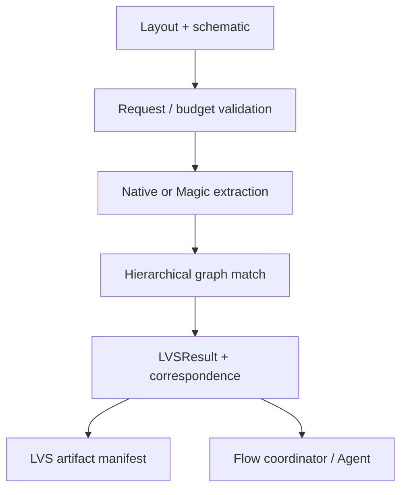

# LVSEngine Design Contract

## Responsibility

LVSEngine compares schematic and layout connectivity, performs optional
layout-netlist extraction, applies device and terminal equivalence policy,
and records a fail-closed verdict with readiness and blocking reasons.

## Foundation integration

`LVSExecuting` refines `CircuiteFoundation.Engine` with
`LVSRequest`/`LVSExecutionResult`. `DefaultLVSEngine.execute` delegates to the
existing `run` path so timeout, cancellation, extraction, waiver, and
persistence behavior remains unchanged.

The domain result retains its fail-closed verdict, diagnostics, correspondence,
and artifact manifest directly. No projection silently hashes or blesses an
unverified report URL.

`LVSRequest.designObjectReference()` gives the requested top cell a stable
Foundation identity. Hierarchical correspondence remains an LVS concern.

## Responsibility boundary

| Concern | Owner |
|---|---|
| Extraction, graph matching, equivalence policy | LVSEngine |
| Tool/deck qualification and independent oracle | LVSEngine |
| Shared evidence/artifact vocabulary | CircuiteFoundation |
| Project state, approvals, resume orchestration | Xcircuite / DesignFlowKernel |

Native LVS may establish a useful development result, but production
qualification still requires the existing independent-oracle and PDK gates.
