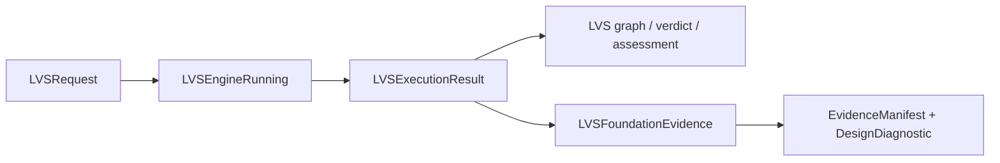

# LVSEngine

## CircuiteFoundation boundary

LVSEngine remains an independent layout-versus-schematic engine. It owns
netlist extraction, graph matching, equivalence policy, and raw LVS evidence.
`CircuiteFoundation` supplies only the shared engine, artifact, evidence,
provenance, diagnostic, and design-object contracts.



`LVSFoundationEvidence` is a stable cross-engine view. It supplements rather
than replaces the LVS evidence packet and artifact manifest, and it does not
turn an unqualified extraction into a match.

LVSEngine is a Swift layout-versus-schematic verification library and command-line tool.
It compares circuit connectivity from SPICE netlists or standard mask data, produces
structured diagnostics, and persists reproducible verification artifacts for developer,
CI, and automated design-flow use.

The project is designed around a fail-closed trust model:

- execution state and electrical verdict are represented separately;
- incomplete extraction, unsupported policy, timeout, and cancellation never become a match;
- matching is deterministic and bounded by explicit resource budgets;
- reports include implementation, process, deck, and artifact provenance;
- production trust is decided externally from observed corpus assertions, independent-oracle evidence and tool identity.

## Xcircuite integration

[`Xcircuite`](https://github.com/1amageek/Xcircuite) is the umbrella runtime
that invokes LVSEngine through a flow stage executor and persists LVS reports,
assessment evidence, diagnostics, and artifact references for Agent/Human
review. LVSEngine remains independently usable and owns extraction, graph
matching, equivalence policy, and raw observations. ToolQualification and the
composing flow policy own tool trust and release decisions.

## Capabilities

| Area | Support |
|---|---|
| Netlist input | SPICE layout and schematic netlists |
| Standard layout input | GDSII, OASIS, CIF, and DXF through `native-gds` |
| Native comparison | Canonical hierarchical graph and deterministic bounded matcher |
| Hierarchy | Recursive subcircuit expansion, parameter binding, occurrence identity, and correspondence |
| Device semantics | MOS, diode, BJT, resistor, capacitor, inductor, independent and controlled sources |
| Device policies | Netgen-derived permutation, property, equivalence, ignore-class, and black-box rules |
| External tools | Netgen comparison adapter and Magic layout-netlist extraction adapter |
| Diagnostics | Typed port, topology, model, parameter, multiplicity, readiness, and policy diagnostics |
| Artifacts | Result report, manifest, correspondence, extraction report, transform ledger, and logs |
| Evidence assessment | Corpus assertions, independent-oracle comparison, coverage audit, observation export, and evidence packet |

## Package products

| Product | Responsibility |
|---|---|
| `LVSEngine` | Umbrella library for application integration |
| `LVSCore` | Requests, results, diagnostics, policies, errors, and artifact contracts |
| `LVSGraph` | Canonical graph and correspondence model |
| `LVSMatching` | Deterministic bounded graph matcher |
| `LVSNetlistParsing` | Native SPICE parsing and hierarchy expansion |
| `LVSNative` | In-process `native` and `native-gds` backends |
| `LVSParsers` | Typed Netgen report parsing |
| `LVSAdapters` | Netgen subprocess adapter |
| `LVSExtractionAdapters` | Magic layout-netlist extraction adapter |
| `LVSPersistence` | Artifact persistence and compact run summaries |
| `LVSRuntime` | Backend registry and default engine composition |
| `LVSCLICore` | Testable command-line implementation |
| `lvsengine` | Executable command-line interface |

The public runtime boundary is `LVSEngineRunning`. `DefaultLVSEngine` provides the
standard composition, while backend and artifact persistence implementations remain
injectable through protocols.

## Requirements

- Swift 6.3 or later
- macOS 26 or later
- `semiconductor-layout` for standard-layout I/O and extraction
- `SignoffToolSupport` for external-tool discovery and bounded subprocess execution

Netgen, Magic, and a Sky130 PDK installation are optional for native SPICE-only use.
They are required for the corresponding external adapters and the complete checked-in
qualification corpus.

The SwiftPM dependencies declared by the package manifest must be resolvable before
building. This document does not assume a parent workspace layout.

## Build

Build the library and executable with SwiftPM:

```bash
swift build
swift build -c release --product lvsengine
```

The executable can be invoked without installing it globally:

```bash
swift run lvsengine --capabilities --json
```

## Library usage

```swift
import Foundation
import LVSEngine

let engine = DefaultLVSEngine()
let request = LVSRequest(
    layoutNetlistURL: URL(filePath: "/path/to/layout.spice"),
    schematicNetlistURL: URL(filePath: "/path/to/schematic.spice"),
    topCell: "top",
    workingDirectory: URL(filePath: "/path/to/output"),
    backendSelection: LVSBackendSelection(backendID: "native")
)

let execution = try await engine.run(request)

switch execution.result.verdict {
case .match:
    print("Equivalent")
case .mismatch:
    print("Not equivalent")
case .blocked:
    print("Verification did not establish a verdict")
}
```

`LVSExecutionResult` contains the typed result plus URLs for persisted reports,
manifests, correspondence, extraction evidence, and transform ledgers when available.

## Command-line usage

### Compare SPICE netlists

```bash
swift run lvsengine \
  --layout-netlist /path/to/layout.spice \
  --schematic-netlist /path/to/schematic.spice \
  --top-cell top \
  --backend native \
  --out /path/to/output \
  --json
```

### Compare standard layout with a schematic

```bash
swift run lvsengine \
  --layout-gds /path/to/design.gds \
  --format gds \
  --tech /path/to/technology.json \
  --extraction-deck /path/to/extraction.tech \
  --schematic-netlist /path/to/schematic.spice \
  --top-cell top \
  --backend native-gds \
  --out /path/to/output \
  --json
```

### Inspect capabilities

```bash
swift run lvsengine --capabilities --json
swift run lvsengine --action-domain --json
```

`--capabilities` describes implemented backends, formats, artifacts, diagnostics, and
qualification requirements. It does not claim that the current build is qualified for
every process. `--action-domain` describes executable operations exposed to automation.

## Backends

### `native`

The native backend parses both SPICE inputs, expands defined subcircuits, binds parameters,
normalizes SPICE numeric suffixes, constructs canonical graphs, and compares them with the
bounded matcher.

Primitive comparison includes:

- MOS source/drain equivalence;
- symmetric resistor, capacitor, and inductor terminals;
- multiplicity and conservative parallel/series aggregation;
- model and terminal equivalence policies;
- component, model, parameter, port, and topology diagnostics.

### `native-gds`

The standard-layout backend reads mask data, applies a technology and extraction deck,
materializes extraction IR, adapts it into the canonical graph, and uses the same matcher
as the native SPICE path. Geometry and occurrence references are preserved for cross-probe
and repair workflows.

### `netgen`

The Netgen adapter runs an external, bounded batch comparison and parses its report into
the same typed result model. Netgen is also used as an independent qualification oracle.

## Foundry device policies

LVSEngine can convert a Netgen setup deck into a structured device-policy seed:

```bash
swift run lvsengine \
  --import-netgen-devices \
  --netgen-setup /path/to/process_setup.tcl \
  --policy-out /path/to/lvs-device-policy.json \
  --report-out /path/to/lvs-device-import-report.json \
  --require-complete \
  --json
```

The importer retains source-line provenance and supports device lists, static `foreach`
expansion, typed runtime `regexp` predicates with capture variables, `permute`, `property`,
`equate classes`, `equate pins`, `ignore class`, and black-box declarations.

Audit the generated seed independently:

```bash
swift run lvsengine \
  --audit-netgen-device-import \
  --policy-seed /path/to/lvs-device-policy.json \
  --import-report /path/to/lvs-device-import-report.json \
  --audit-out /path/to/lvs-device-import-audit.json \
  --require-satisfied \
  --json
```

Apply the policy during comparison with `--device-policy`. Unsupported rules are retained
as typed ignored-rule evidence. Rules whose selectors match no model in the current design
are recorded separately as unobserved coverage signals.

## Diagnostics and verdicts

The result contract separates execution from verification:

| Execution status | Verdict | Meaning |
|---|---|---|
| `completed` | `match` | Equivalence is established and readiness gates passed |
| `completed` | `mismatch` | Non-equivalence is established |
| `completed` | `blocked` | Required semantics or evidence are incomplete |
| `timedOut` | `blocked` | The configured deadline was reached |
| `cancelled` | `blocked` | Cancellation was acknowledged |
| `failed` | `blocked` | Input, parser, tool, or persistence failed |

A passing result requires all of the following:

- completed execution;
- a match verdict;
- ready tool state;
- no blocking reasons;
- no active, unwaived error diagnostics.

Diagnostics include stable rule IDs, categories, component signatures, model and parameter
values, layout/schematic counts, ports, source references, suggested fixes, and waiver
metadata where applicable.

## Artifacts

Each run can persist:

| Artifact | Purpose |
|---|---|
| LVS report | Complete request, result, diagnostics, policy application, and provenance |
| Artifact manifest | Input/output hashes, byte counts, implementation identity, and result digest |
| Correspondence | Device, net, port, and occurrence mappings |
| Extracted layout netlist | Reviewable intermediate SPICE from standard-layout extraction |
| Extraction report | Process/deck identity, extraction diagnostics, and geometry evidence |
| Transform ledger | Hierarchy flattening and geometry transformation history |
| Log | Human-readable execution summary |

`LVSRunSummaryBuilder` produces a compact review projection while preserving the complete
report as the source of truth.

## Waivers

Pass a waiver artifact with `--waivers` or `LVSRequest.waiverURL`. A waiver preserves the
original error severity and records its ID and reason, but excludes the diagnostic from the
active error count. Waivers cannot convert a mismatch or blocked verdict into a match.

Unused waiver IDs remain visible in the persisted waiver report.

## Corpus assessment

Run a corpus with:

```bash
swift run lvsengine \
  --corpus /path/to/lvs-corpus.json \
  --out /path/to/corpus-output \
  --json
```

A corpus can require:

- expected match or mismatch verdicts;
- active diagnostic rule IDs;
- duration, search, depth, and memory budgets;
- deterministic repeated execution;
- cancellation behavior;
- report, manifest, correspondence, and extraction artifacts;
- independent-oracle agreement and identity;
- foundry device-policy import, application, and rule-family observations.

The runner writes case artifacts and a top-level `lvs-corpus-report` containing aggregate
metrics and a durable assessment. Missing tools and oracle failures are recorded
as structured blocked evidence rather than aborting without a report.

Re-evaluate or export a saved report without rerunning the corpus:

```bash
swift run lvsengine --assess-corpus-report /path/to/lvs-corpus-report.json --json

swift run lvsengine \
  --audit-corpus-coverage /path/to/lvs-corpus-report.json \
  --coverage-policy /path/to/coverage-policy.json \
  --checked-at 2026-07-12T00:00:00Z \
  --out /path/to/lvs-corpus-coverage-audit.json \
  --json

swift run lvsengine \
  --observations-from-corpus-report /path/to/lvs-corpus-report.json \
  --record-id lvs-release-corpus \
  --out /path/to/lvs-corpus-observations.json \
  --json

swift run lvsengine \
  --evidence-packet-from-corpus-report /path/to/lvs-corpus-report.json \
  --out /path/to/lvs-evidence-packet.json \
  --json
```

## Production scope

The checked-in physical qualification corpus covers Sky130 1.8 V digital-MOS standard
cells with GDS extraction and an independent Netgen oracle. This is deliberately narrower
than the parser and API surface.

Support for a format or policy does not by itself qualify every process or device family.
Analog, RF, memory, high-voltage, additional PDKs, and arbitrary hierarchical physical
designs require their own process/deck/build-bound evidence.

## Testing

Run tests with a timeout and a focused target:

```bash
perl -e 'alarm shift; exec @ARGV' 30 \
  xcodebuild test \
  -scheme LVSEngine-Package \
  -destination 'platform=macOS' \
  -only-testing:LVSCLICoreTests
```

The million-device matcher envelope has a longer explicit budget:

```bash
perl -e 'alarm shift; exec @ARGV' 330 \
  xcodebuild test \
  -scheme LVSEngine-Package \
  -destination 'platform=macOS' \
  -only-testing:LVSMatchingTests
```

External-tool tests report readiness and skip when their optional executable or PDK input
is unavailable. Release qualification must run the production corpus with the independent
oracle and retain the exact implementation, process, and deck identity.

## Design authority

The canonical result and graph contracts are documented in the repository ADR:

[LVS Result v2 and Canonical Authority](https://github.com/1amageek/LVSEngine/blob/main/docs/adr/0001-lvs-result-v2-and-canonical-authority.md)

Repository: [github.com/1amageek/LVSEngine](https://github.com/1amageek/LVSEngine)
